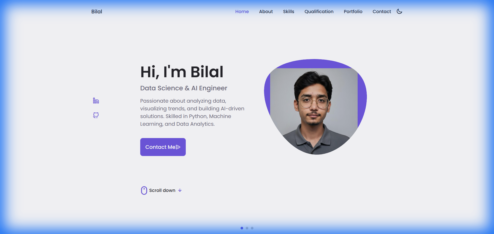

# Abdul Razak Bilal - Personal Portfolio



## 📄 Overview

This is my personal portfolio website designed to showcase my skills, qualifications, and projects as a **Data Science & AI Engineer**. The design is fully responsive, featuring a clean modern UI with a dark/light mode toggle.

Hosted live at: [Link to your GitHub Pages or Live URL]

## ✨ Features

- **Responsive Design**: Adapts seamlessly to Mobile, Tablet, and Desktop screens.
- **Dark/Light Mode**: User-friendly theme toggle.
- **Interactive Elements**:
    - Smooth scrolling navigation.
    - Skills accordion.
    - Qualification tabs.
    - Portfolio project swiper.
- **Dynamic Content**: Populated with my latest education, experience, and projects.

## 🛠️ Technologies Used

- **HTML5**: Semantic structure.
- **CSS3**: Custom properties, Flexbox, and Grid layout.
- **JavaScript**: UI logic and interactivity.
- **Boxicons / Unicons**: For scalable vector icons.
- **Swiper.js**: For the portfolio carousel.

## 🚀 Setup & Usage

To run this project locally:

1.  **Clone the repository**:
    ```bash
    git clone https://github.com/abdulrazakbilal/portfolio.git
    ```
2.  **Navigate to the project directory**:
    ```bash
    cd portfolio
    ```
3.  **Open `index.html`**:
    Simply open the `index.html` file in your preferred web browser.

## 🤝 Credits

- Design inspiration by [Bedimcode](https://github.com/bedimcode).
- Developed by **Abdul Razak Bilal**.

---
*Feel free to star ⭐ this repository if you find it useful!*
